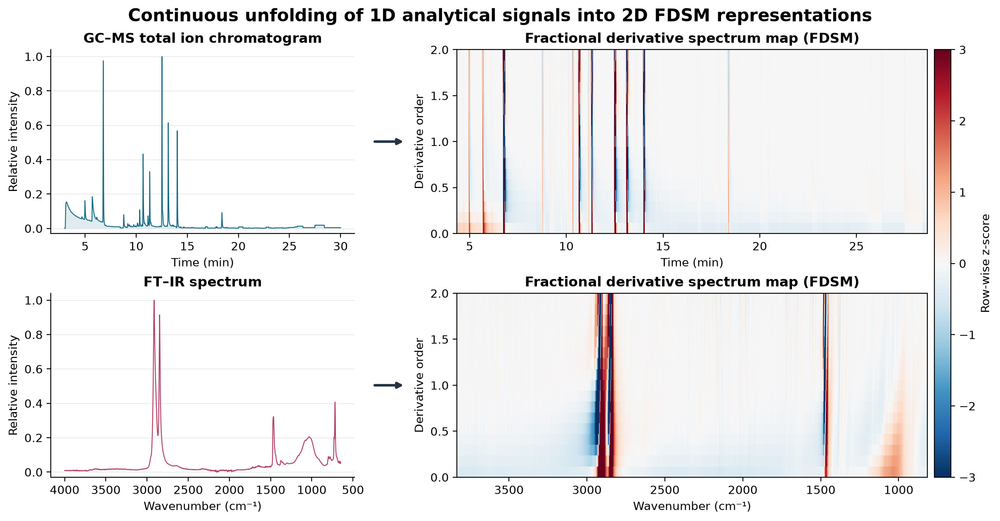

# FDSM

[](https://github.com/orxp/fdsm-map/actions/workflows/tests.yml)

FDSM expands a uniformly sampled one-dimensional signal into a two-dimensional
fractional derivative spectrum map. Rows contain FFT-based derivatives across a
continuous order ladder, while columns retain the original signal coordinate.
The resulting numerical map is intended for CNN-based or other image-like signal
analysis.



The overview above is generated reproducibly from public GC–MS and FT–IR
example files; see [the data provenance and figure recipe](docs/example-data.md).

The transform is domain-independent. The included GC-MS and FT-IR files are
public examples of the input and output workflow, not required runtime data.

## Installation

For local development:

```bash
python -m venv .venv
python -m pip install -e ".[dev,plot]"
```

The core transform requires only NumPy and SciPy. Matplotlib is optional.

On Windows installations using a legacy locale, an editable install located
under a non-ASCII parent path may produce an unreadable `.pth` file. In that
case, develop from an ASCII-only path or install the built wheel instead. This
does not affect normal wheel installations.

## Quick start

```python
import numpy as np
from fdsm import transform

x = np.linspace(0.0, 10.0, 1001)
y = np.sin(2 * np.pi * 0.7 * x) + 0.25 * np.sin(2 * np.pi * 2.1 * x)

result = transform(
    y,
    x=x,
    min_order=0.0,
    max_order=2.0,
    order_step=0.125,
    sg_window=11,
    sg_polyorder=3,
)

print(result.map.shape)   # (17, 901) with the default 5% crop per edge
print(result.orders)
print(result.x)
```

If `x` is omitted, samples are treated as uniformly spaced with `delta=1`.
Strictly descending axes are reversed together with the signal. A genuinely
nonuniform axis raises an error by default because FFT differentiation assumes a
uniform grid.

## Batch transform

```python
from fdsm import transform_batch

signals = np.stack([y, 0.5 * y, y + 0.1 * np.cos(x)])
batch = transform_batch(signals, x=x, order_step=0.25)
print(batch.map.shape)    # (3, 9, 901)
```

## Public-data example

Install the plotting extra and generate the same two-modality image shown at
the top of this page:

```bash
python -m pip install ".[plot]"
python examples/make_toc_figure.py
```

The script downloads hash-pinned raw files into the Git-ignored
`examples/data/raw/` directory, explicitly resamples the irregularly timed TIC,
and writes `docs/assets/fdsm_1d_to_2d.png`. Figure layout remains example code,
not part of the numerical library API.

## Command line

The CLI accepts a text/CSV file containing either one signal column or an axis and
signal column:

```bash
fdsm signal.csv map.npz --x-column 0 --y-column 1 \
  --order-step 0.125 --sg-window 11 --sg-polyorder 3
```

The output archive contains `map`, `x`, `orders`, and JSON-encoded metadata.

## Input contract

- `y` must be a finite, real, one-dimensional signal.
- `x`, when supplied, must be finite, strictly monotonic, and uniformly spaced
  within the configured tolerance.
- Small floating-point deviations from a uniform grid are accepted.
- Nonuniform sampling is not silently resampled. Resample explicitly before the
  transform, or deliberately choose `nonuniform="warn"` or `"ignore"`.
- Savitzky-Golay smoothing can be controlled with `sg_window` and
  `sg_polyorder`, or disabled with `sg_window=None`.
- The default output is `float32`, suitable for downstream neural-network input.

See [docs/algorithm.md](docs/algorithm.md) for the transform definition and
numerical policies. Automated and numerical checks are summarized in
[docs/validation.md](docs/validation.md).

## Nyquist-bin handling

`nyquist="retain"` keeps the unpaired Nyquist coefficient, calculates a full
complex inverse FFT, and returns its real component. For an even transform
length, the unpaired bin can leave a small discarded imaginary residual at
noninteger orders.

`nyquist="zero_unpaired"` removes an unpaired Nyquist coefficient whenever its
fractional multiplier is complex, enforcing a real-valued discrete transform.
It is an explicit alternative to the default retention policy.

## Scope

FDSM is a transformation library, not a trained classifier. It produces the
derivative-order map and does not prescribe a particular classifier or model
architecture. Users should evaluate its suitability for their own uniformly
sampled one-dimensional signals and downstream tasks.

## Citation and license

FDSM is provided under the [MIT License](LICENSE), with copyright held by the
National Forensic Service. Citation metadata, including the preferred research
article citation, is provided in [CITATION.cff](CITATION.cff).

If you use FDSM, please cite the research article and the software release:

- C. Park, K.-M. Kim, W. Park, D.-k. Lee, and J. Jung,
  "Fractional derivative spectrum maps for robust forensic classification of
  GC–MS total ion chromatograms and FT-IR spectra,"
  *Forensic Chemistry* (2026), 100783.
  [Article DOI: 10.1016/j.forc.2026.100783](https://doi.org/10.1016/j.forc.2026.100783).
- FDSM software, version 0.1.0.
  [Software DOI: 10.5281/zenodo.23038920](https://doi.org/10.5281/zenodo.23038920).

Public example datasets remain subject to their source terms and are not
relicensed by this repository.
